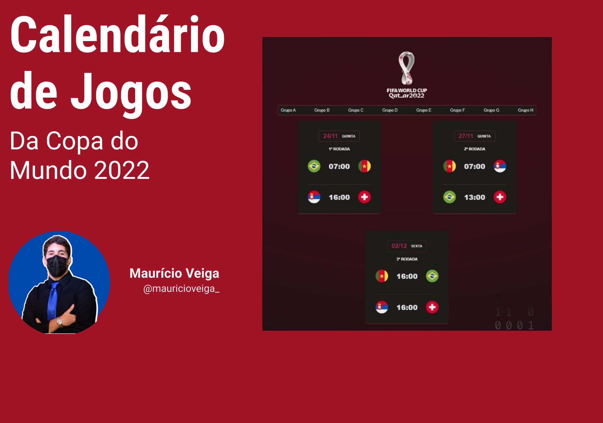

<h1 align="center"> Calendário Copa do Mundo 2022 </h1>

Site de uma agenda dos respectivos dos jogos da 1º, 2º e 3º rodadas da Copa do Mundo 2022 do Qatar dividido pelos seus Grupos

  
  

## 🚀 Tecnologias

Esse projeto foi desenvolvido com as seguintes tecnologias:

- HTML e CSS
- JavaScript
- Git e GitHub

## 💻 Projeto
O projeto, criado com o aprendizado do evento NLW COPA da Rocketseat, foi criado para aprimorar os aprendizados nas linguagens HTML, CSS, JavaScript, criando um site  com cards de jogos da Copa do Mundo 2022 ⚽🏆 e seus respectivos jogos, separando as seleções pelos grupos, contendo o confronto e o horário do mesmo. É um site minimamente interativo, na parte dos Grupos pode-se clicar e trocar para o grupo selecionado.

